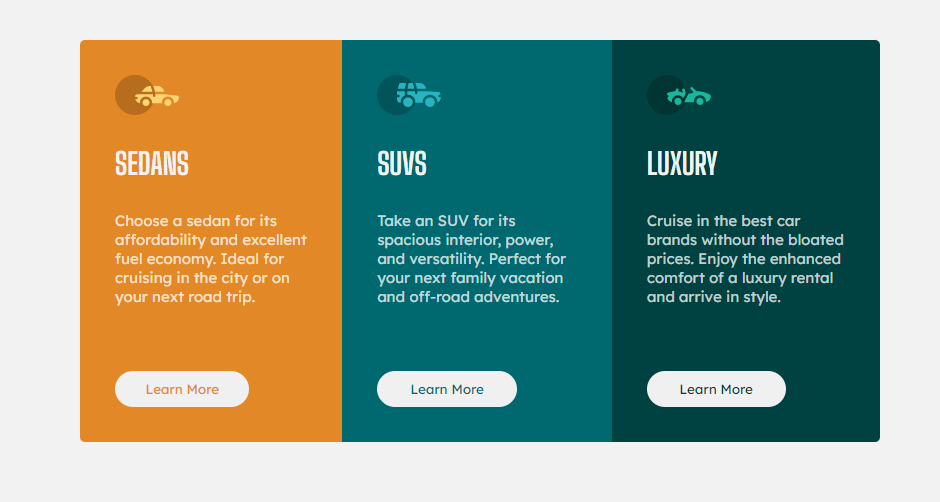

# Frontend Mentor - 3-column preview card component solution

This is a solution to the [3-column preview card component challenge on Frontend Mentor](https://www.frontendmentor.io/challenges/3column-preview-card-component-pH92eAR2-). Frontend Mentor challenges help you improve your coding skills by building realistic projects. 

## Table of contents

- [Overview](#overview)
  - [The challenge](#the-challenge)
  - [Screenshot](#screenshot)
  - [Links](#links)
- [My process](#my-process)
  - [Built with](#built-with)
  - [What I learned](#what-i-learned)
  - [Continued development](#continued-development)
  - [Useful resources](#useful-resources)
- [Author](#author)

**Note: Delete this note and update the table of contents based on what sections you keep.**

## Overview

### The challenge

Users should be able to:

- View the optimal layout depending on their device's screen size
- See hover states for interactive elements

### Screenshot

### Links

- Live Site URL: [3columncard-mwiafeansong.netlify.app](https://3columncard-mwiafeansong.netlify.app/)

## My process

### Built with

- Semantic HTML5 markup
- CSS custom properties
- Flexbox

### What I learned

- Specifying max-widths in media queries to keep cards from getting too big on a tablet screen

### Continued development

- Flex shrink, flex grow and flex basis

### Useful resources

- [Introduction to Responsive Web Design by freecodecamp](https://www.youtube.com/watch?v=srvUrASNj0s&t=1066s) - This helped me with layout on smaller screens.

## Author

- Frontend Mentor - [@yourusername](https://www.frontendmentor.io/profile/mwiafeansong)